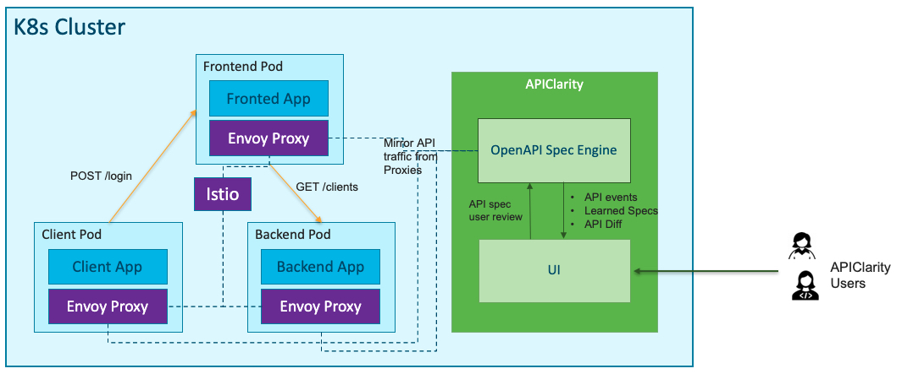

# APIClarity


Reconstruct [OpenAPI Specifications](https://spec.openapis.org/oas/latest.html)
from real-time workload traffic seamlessly.

## Microservices API challenges

- Not all applications have an OpenAPI specification available
- How can we get this for legacy or external applications?
- Detect whether microservices still use deprecated APIs (a.k.a. Zombie APIs)
- Detect whether microservices use undocumented APIs (a.k.a. Shadow APIs)
- Generate OpenAPI specifications without code instrumentation or
  modifying existing workloads (seamless documentation)

## Solution

- Capture all API traffic in an existing environment using a service mesh
  framework (e.g. [Istio](https://istio.io/))
- Construct an OpenAPI specification by observing API traffic or upload a
  reference OpenAPI spec
- Review, modify and approve automatically generated OpenAPI specs
- Alert on any differences between the approved API specification and the API
  calls observed at runtime; detects shadow & zombie APIs
- UI dashboard to audit and monitor the findings

## High level architecture




## Getting started

### Supported traffic source integrations
APIClarity supports integrating with the following taffic sources. Install APIClarity and follow the instructions per required integration.

* Istio Service Mesh
  * Make sure that Istio 1.10+ is installed and running in your cluster.
  See the [Official installation instructions](https://istio.io/latest/docs/setup/getting-started/#install)
  for more information.

* Kong API Gateway

  * [Integration instructions](https://github.com/apiclarity/apiclarity/tree/master/plugins/gateway/kong)

* Tyk API Gateway
  * [Integration instructions](https://github.com/apiclarity/apiclarity/tree/master/plugins/gateway/tyk)

### Install APIClarity in a K8s cluster using Helm:

1. Add Helm repo

   ```shell
   helm repo add apiclarity https://apiclarity.github.io/apiclarity
   ```

2. Deploy APIClarity with Helm

   ```shell
   helm install --set 'global.namespaces={namespace1,namespace2}' --create-namespace apiclarity apiclarity/apiclarity -n apiclarity
   ```
  **Note**:
  Helm configures the monitored namespaces only for Istio intergation.
  namespace1 and namespace2 are the namespaces where the Envoy Wasm filters will be deployed to allow traffic tracing. Leave the namespaces list empty when Istio   integration is not needed.

3. Port forward to APIClarity UI:

   ```shell
   kubectl port-forward -n apiclarity svc/apiclarity-apiclarity 9999:8080
   ```

4. Open APIClarity UI in the browser: <http://localhost:9999/>
5. Generate some traffic in the traced applications and check the APIClarity UI :)

## Configurations

The file [values.yaml](https://github.com/apiclarity/apiclarity/blob/master/charts/apiclarity/values.yaml) is used to deploy and configure APIClarity on your cluster via Helm.
[This ConfigMap](https://github.com/apiclarity/apiclarity/blob/master/charts/apiclarity/templates/configmap.yaml) is used to define the list of headers to ignore when reconstructing the spec.

## Testing with a demo application

A good demo application to try APIClarity with is the [Sock Shop Demo](https://microservices-demo.github.io/).

To deploy the Sock Shop Demo follow these steps:

1. Create the `sock-shop` namespace and enable Istio injection:

   ```shell
   kubectl create namespace sock-shop
   kubectl label namespaces sock-shop istio-injection=enabled
   ```

2. Deploy the Sock Shop Demo to your cluster:

   ```shell
   kubectl apply -f https://raw.githubusercontent.com/microservices-demo/microservices-demo/master/deploy/kubernetes/complete-demo.yaml
   ```

3. Deploy APIClarity in the `sock-shop` namespace:

   ```shell
   helm install --set 'global.namespaces={sock-shop}' apiclarity apiclarity/apiclarity -n apiclarity
   ```

4. Find the NodePort to access the Sock Shop Demo App

   ```shell
   $ kubectl describe svc front-end -n sock-shop
   [...]
   NodePort:                 <unset>  30001/TCP
   [...]
   ```

   Use this port together with your node IP to access the demo webshop and run
   some transactions to generate data to review on the APIClarity dashboard.

## Building

### Building from source:
Build and push the image to your repo:

```shell
DOCKER_IMAGE=<your docker registry>/apiclarity/apiclarity DOCKER_TAG=<your tag> make push-docker
```
Update [values.yaml](https://github.com/apiclarity/apiclarity/blob/master/charts/apiclarity/values.yaml) accordingly.

## Running locally with demo data

1. Build UI & backend locally as described above:

   ```shell
   make ui && make backend
   ```

2. Copy the built site:

   ```shell
   cp -r ./ui/build ./site
   ```

3. Run backend and frontend locally using demo data:

   ```shell
   DATABASE_DRIVER=LOCAL FAKE_TRACES=true FAKE_TRACES_PATH=./backend/pkg/test/trace_files \
   ENABLE_DB_INFO_LOGS=true ./backend/bin/backend run
   ```

4. Open APIClarity UI in the browser: <http://localhost:8080/>

## Contributing

Pull requests and bug reports are welcome.

For larger changes please create an Issue in GitHub first to discuss your
proposed changes and possible implications.

## License

[Apache License, Version 2.0](https://www.apache.org/licenses/LICENSE-2.0)
