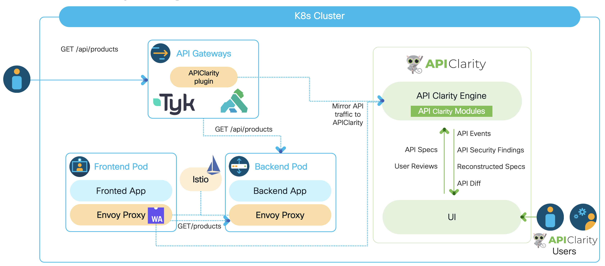

# APIClarity


APIClarity is a modular tool that addresses several aspects of API Security, focusing specifically on [OpenAPI](https://spec.openapis.org/oas/latest.html) based APIs.

APIClarity approaches API Security in 2 different ways:
- Captures all API traffic in a given environment and performs a set of security analysis to discover all potential security problems with detected APIs
- Actively tests API endpoints to detect security issues in the implementation of such APIs.

## OpenAPI automatic reconstruction
Both approaches described above are way more effective when APIClarity is primed with the OpenAPI specifications of the APIs analyzed or tested. However, not all applications have an OpenAPI specification available. For this reason one of the main functionality of APIClarity is the automatic reconstruction of OpenAPI specifications based on observed API traffic. In this case, users have the ability to review and approve the reconstructed specifications.

## Security Modules
APIClarity is structured in a modular architecture, which allows to easily add new functionalities.

In the following a brief description of the modules currently implemented:

- **Spec Diffs** This module compares the API traces with the OAPI specifications provided by the user or previously reconstructed. The result of this comparison provides:
    - List of API endpoints that are observed but not documented in the specs, i.e. _Shadow APIs_;
    - List of API endpoints that are observed but marked as deprecated in the specs, i.e. _Zombie APIs_;
    - List of difference between of the APIs observed and their documented specification.
- [**Trace Analyzer**](./backend/pkg/modules/internal/traceanalyzer/README.md) This module analyzes path, headers and body of API requests and responses to discover potential security issues, such as weak authentications, exposure of sensitive information, potential Broken Object Level Authorizations (BOLA) etc.
- [**BFLA Detector**](./backend/pkg/modules/internal/bfla/README.md) This module detects potential Broken Function Level Authorization. In particular it observes the API interactions and build an authorization model that captures what clients are supposed to be authorized to make the various API calls. Based on such authorization model it then signals violations which may represent potential issues in the API authorization procedures.
- **Fuzzer** This module actively tests API endpoints based on their specification attempting in discovering security issues in the API server implementation.

## High level architecture



## Getting started

### Supported traffic source integrations

APIClarity supports integrating with the following traffic sources. Install APIClarity and follow the instructions per required integration.

* Istio Service Mesh
  * Make sure that Istio 1.10+ is installed and running in your cluster.
  See the [Official installation instructions](https://istio.io/latest/docs/setup/getting-started/#install)
  for more information.

* Tap via a DaemonSet
  * [Integration instructions](https://github.com/openclarity/apiclarity/tree/master/plugins/taper)

* Kong API Gateway
  * [Integration instructions](https://github.com/openclarity/apiclarity/tree/master/plugins/gateway/kong)

* Tyk API Gateway
  * [Integration instructions](https://github.com/openclarity/apiclarity/tree/master/plugins/gateway/tyk)

* OpenTelemetry Collector (traces only)
  * [Integration instructions](https://github.com/openclarity/apiclarity/tree/master/plugins/otel-collector)

The integrations (plugins) for the supported traffic sources above are located in the [plugins directory within the codebase](https://github.com/openclarity/apiclarity/tree/master/plugins) and implement the [plugins API](https://github.com/openclarity/apiclarity/tree/master/plugins/api) to export the API events to APIClarity. To enable and configure the supported traffic sources, please check the ```trafficSource:``` section in [Helm values](https://github.com/openclarity/apiclarity/blob/master/charts/apiclarity/values.yaml).
Contributions of integrations with additional traffic sources are more than welcome!

### Install APIClarity in a K8s cluster using Helm:

1. Add Helm repo

   ```shell
   helm repo add apiclarity https://openclarity.github.io/apiclarity
   ```

2. Save APIClarity default chart values

    ```shell
    helm show values apiclarity/apiclarity > values.yaml
    ```

3. Update `values.yaml` with the required traffic source values

4. Deploy APIClarity with Helm for the selected traffic source

   ```shell
   helm install --values values.yaml --create-namespace apiclarity apiclarity/apiclarity -n apiclarity
   ```

5. Port forward to APIClarity UI:

   ```shell
   kubectl port-forward -n apiclarity svc/apiclarity-apiclarity 9999:8080
   ```

6. Open APIClarity UI in the browser: <http://localhost:9999/>
7. Generate some traffic in the traced applications and check the APIClarity UI :)

### Uninstall APIClarity from a K8s cluster using Helm:

1. Helm uninstall

   ```shell
   helm uninstall apiclarity -n apiclarity
   ```

2. Clean resources

    By default, Helm will not remove the PVCs and PVs for the StatefulSets. Run the following command to delete them all:

    ```shell
    kubectl delete pvc -l app.kubernetes.io/instance=apiclarity -n apiclarity
    ```

## Configurations

The file [values.yaml](https://github.com/openclarity/apiclarity/blob/master/charts/apiclarity/values.yaml) is used to deploy and configure APIClarity on your cluster via Helm.
[This ConfigMap](https://github.com/openclarity/apiclarity/blob/master/charts/apiclarity/templates/configmap.yaml) is used to define the list of headers to ignore when reconstructing the spec.

## Testing with a demo application

A good demo application to try APIClarity with is the [Sock Shop Demo](https://microservices-demo.github.io/).

To deploy the Sock Shop Demo, follow these steps:

1. Create the `sock-shop` namespace and enable Istio injection:

   ```shell
   kubectl create namespace sock-shop
   kubectl label namespaces sock-shop istio-injection=enabled
   ```

2. Deploy the Sock Shop Demo to your cluster:

   ```shell
   kubectl apply -f https://raw.githubusercontent.com/microservices-demo/microservices-demo/master/deploy/kubernetes/complete-demo.yaml
   ```

3. Deploy APIClarity in the `sock-shop` namespace (e.g. Istio service-mesh traffic source):

   ```shell
   helm repo add apiclarity https://openclarity.github.io/apiclarity
   ```

   ```shell
   helm install --set 'trafficSource.envoyWasm.enabled=true' --set 'trafficSource.envoyWasm.namespaces={sock-shop}' --create-namespace apiclarity apiclarity/apiclarity -n apiclarity
   ```

4. Port forward to Sock Shop's front-end service to access the Sock Shop Demo App:

   ```shell
   kubectl port-forward -n sock-shop svc/front-end 7777:80
   ```

   Open the Sock Shop Demo App UI in the browser (<http://localhost:7777/>) and run
   some transactions to generate data to review on the APIClarity dashboard.

## Building

### Building from source:

Build and push the image to your repo:

```shell
DOCKER_IMAGE=<your docker registry>/apiclarity DOCKER_TAG=<your tag> make push-docker
```

Update [values.yaml](https://github.com/openclarity/apiclarity/blob/master/charts/apiclarity/values.yaml) accordingly.

## Running locally with demo data

1. Build UI & backend locally as described above:

   ```shell
   make ui && make backend
   ```

2. Copy the built site:

   ```shell
   cp -r ./ui/build ./site
   ```

3. Run backend and frontend locally using demo data:

   Note: You might need to delete the old local state file and local db:

   ```shell
   rm state.gob; rm db.db
   ```

   ```shell
   DATABASE_DRIVER=LOCAL K8S_LOCAL=true FAKE_TRACES=true FAKE_TRACES_PATH=./backend/pkg/test/trace_files \
   ENABLE_DB_INFO_LOGS=true ./backend/bin/backend run
   ```
   Note: this command requires a proper KUBECONFIG in your environment when __K8S_LOCAL=true__ is used. If you want to run without k8s, use __ENABLE_K8S=false__ instead.

4. Open APIClarity UI in the browser: <http://localhost:8080/>

## Enabling External Trace Sources Support
Enabling external trace sources support, APIClarity can receive the trace sources from the entitites that are external to the K8s cluster. External trace sources such as Gateways, Load balancers, etc. can communicate with APIClarity to report APIs and send the traces. 

The following section describes how to deploy APIClarity with the support for external trace sources
1.	Add Helm Repo
```shell
helm repo add apiclarity https://openclarity.github.io/apiclarity
```

2.	Update values.yaml with 
```shell
Apiclarity -> tls -> enabled as true
supportExternalTraceSource -> enabled as true
```

3.	Deploy APIClarity with the Helm enabling external traffic sources
```shell
helm install --values values.yaml --create-namespace apiclarity apiclarity/apiclarity -n apiclarity
```

4.	Port forward to APIClarity UI:
```shell
kubectl port-forward -n apiclarity svc/apiclarity-apiclarity 9999:8080
```

5.	Open APIClarity UI in the browser:
```shell
http://localhost:9999 
```

The following section describes how to register a new external trace source. And this section includes how to access the service, register a new trace source, and how to receive the token and certificate.
1.	Port forward for service at 8443
```shell
kubectl port-forward -n apiclarity svc/apiclarity-apiclarity 8443:8443
```

2.	Register a new external trace source and receive the token 
```shell
TRACE_SOURCE_TOKEN=$(curl --http1.1 --insecure -s -H 'Content-Type: application/json' -d '{"name":"apigee_gateway","type":"APIGEE_X"}' https://localhost:8443/api/control/traceSources|jq -r '.token')
```

3. Receive the certificate
To receive the certificate, get the External-IP for the service named as apiclarity-external
```shell
kubectl get services -n apiclarity
```
Then, use the External-IP address with the following command, then extract the certificate with -----BEGIN CERTIFICATE----- and -----END CERTIFICATE----- and save to server.crt
```shell
openssl s_client -showcerts -connect <External-IP>:10443
```

Use the above extracted token at the step-2 and certificate at step-3 for configuring subsequent external trace sources such as Apigee X Gateway and BIG-IP LTM Load balancer

## Supported Trace Sources
APIClarity can support with the following trace sources and follow the instructions per required integration.

* Apigee X Gateway
  * [Integration instructions](https://github.com/openclarity/apiclarity/tree/master/plugins/gateway/apigeex)
* BIG-IP LTM Load balancer
  * [Integration instructions](https://github.com/openclarity/apiclarity/tree/master/plugins/gateway/f5-bigip)
* Kong
  * [Integration instructions](https://github.com/openclarity/apiclarity/tree/master/plugins/gateway/kong)
* Tyk
  * [Integration instructions](https://github.com/openclarity/apiclarity/tree/master/plugins/gateway/tyk)

## Contributing

Pull requests and bug reports are welcome.

For larger changes please create an Issue in GitHub first to discuss your
proposed changes and possible implications.

## Contributors

https://panoptica.app

## License

[Apache License, Version 2.0](https://www.apache.org/licenses/LICENSE-2.0)
