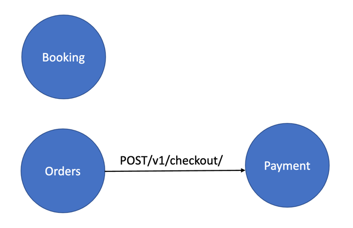
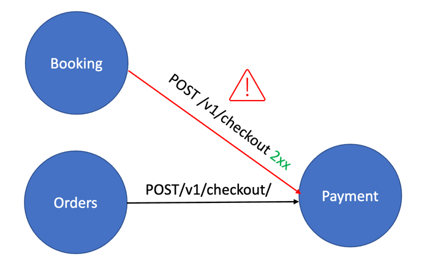
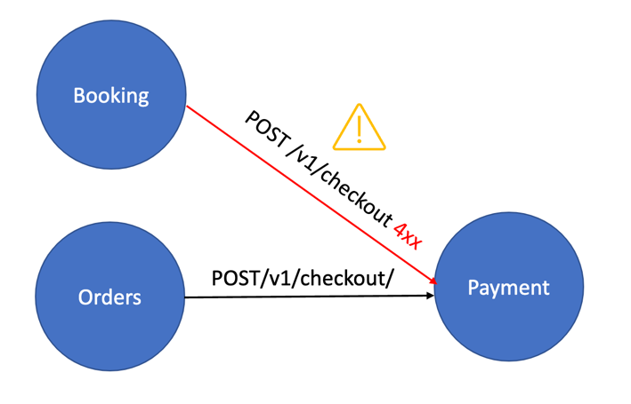

# Broken Function Level Authorization (BFLA)

Detection of potential BFLA issues for internal services in a Kubernetes cluster

This module will observe traffic in real time and build a model of service interactions.
We call it authorization model, because this in essence represents which service interactions are allowed and which are not allowed.

The process consists of two phases
 1. Learning phase
 2. Detection phase

## Learning
The learning phase begins as soon as a user uploads or reconstructs a spec for a given API.
by default the learning lasts for 100 API calls (for an API), the learning can be stopped reset or prolonged for a longer period.

(Orders) -> POST /v1/checkout -> (Payment): This call is detected during the learning phase

## Detection
Once the learning phase has ended, the detection phase begins. 
During the detection phase all the API calls that do not comply with the authorization model will be marked as warnings.
If the call was rejected by the api the warning will have a lower severity, however if the API accepted the unexpected call and returned a 2xx status code it will have a higher severity (check fig1 and fig2).

**(Booking) -> POST /v1/checkout (2xx) -> (Payment)**: This call was not registered in the authorization model during the learning phase so the BFLA module will raise a warning. And since the response has a 2xx status code the warning has a high severity.

**(Booking) -> POST /v1/checkout (4xx) -> (Payment)**: This call was not registered in the authorization model during the learning phase so the BFLA module will raise a warning. The warning has a lower severity because the API rejected this call.

## Module interaction

In case of a false positive, meaning that a certain service interaction was wrongly marked as legitimate, 
the user can mark it as illegitimate and if service interaction was wrongly marked as illegitimate, the user can mark it as legitimate

The user can also stop stat and reset learning.

List of all operations for tuning the authorization model:
 1. Mark event as legitimate.  
 2. Mark event as illegitimate
 3. Stop learning
 4. Start learning
 5. Reset learning
